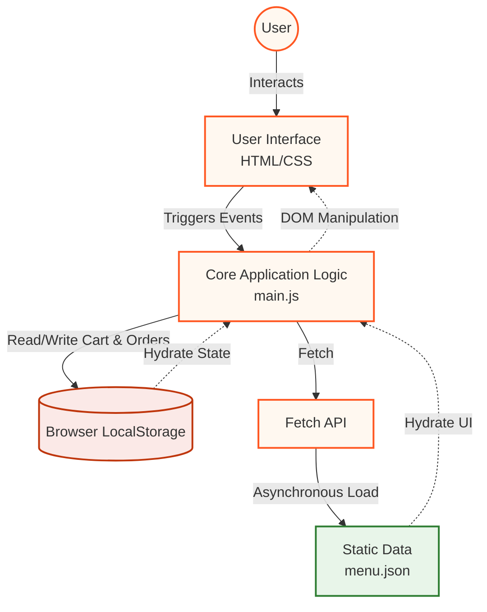

<h1 align="center" id="chaatbazaar">ChaatBazaar 🍴 </h1>

<p align="center">
  <strong>An interactive, client-side web application bringing authentic Indian street food to your fingertips.</strong>
</p>

<p align="center">
  <a href="https://patelharsh2006.github.io/ChaatBazaar/">Live Demo</a> •
  <a href="#-system-architecture">Architecture</a> •
  <a href="#-technical-design-decisions-adrs">Design Decisions</a> •
  <a href="#-contributing">Contributing</a>
</p>


## 🚀 Executive Summary

**ChaatBazaar** is a responsive, mobile-first web application engineered to simulate a dynamic e-commerce food delivery platform. By leveraging a strict client-side architecture without a backend dependency, it offers an incredibly fast and seamless ordering experience. It utilizes the browser's native capabilities (`LocalStorage`, `Fetch API`) for state management and data hydration.

## 🏗️ System Architecture

The application follows a monolithic client-side architecture. State is strictly managed within the browser, and data is hydrated asynchronously from static JSON assets.



### Architectural Layers
1. **Presentation Layer (`.html`, `.css`)**: Responsive, CSS-grid-heavy layout with modern UI tokens (glassmorphism, CSS variables).
2. **Business Logic Layer (`main.js`)**: Encapsulates cart logic, fuzzy-search algorithms, advanced filtering, and state hydration.
3. **Data Layer (`menu.json`)**: Serves as a read-only NoSQL-like document store loaded into memory upon initialization.

## 📝 Technical Design Decisions (ADRs)

| Decision | Rationale | Trade-offs |
|----------|-----------|------------|
| **Vanilla JS over Frameworks** | Ensures zero build steps, rapid prototyping, and lowers the barrier to entry for open-source contributors. | Lacks reactive DOM updates; requires manual DOM manipulation. |
| **LocalStorage State Management** | Enables session persistence for the Cart and Orders without requiring a backend database or authentication. | Data is localized to the specific device/browser and lacks cross-device syncing. |
| **Static JSON Hydration** | Simulates a REST API call asynchronously. Allows easy schema updates without touching JS logic. | Cannot simulate dynamic inventory or real-time stock levels. |


## ✨ Core Features

- **Asynchronous Data Loading**: Non-blocking data fetch operations.
- **Fuzzy Search Algorithm**: Custom sequence-matching search functionality for menu items.
- **Stateful Shopping Cart**: Persists across tabs and reloads natively using browser storage.
- **Client-side Filtering**: Multi-parameter filter engine (Price, Spice, Rating, Dietary).


## 💻 Tech Stack

Built with modern, lightweight web technologies focusing on zero-dependency delivery:
*  Semantic Structure
*  Flexbox, CSS Grid, Advanced Selectors
*  ES6+, Fetch API, LocalStorage
*  Static Data Layer


## 🤝 Contributing

We welcome contributions to expand the architecture! 

### Architectural Guidelines for Contributors
1. **Maintain the Theme**: Ensure UI components utilize the core orange palette (`#ff5722`, `#bf360c`).
2. **Visual Evidence**: Include "Before" and "After" screenshots of the webpage for all UI changes in the PR.
3. **Local Testing**: Run the project through a local server (e.g., VSCode Live Server) to bypass CORS restrictions on the `fetch()` API loading local JSON.

### Synchronization Workflows
Keep your fork in sync with the upstream repository to prevent merge conflicts.

#### Method 1: CLI Workflow (Recommended for Engineers)
```bash
# 1. Fetch latest changes from upstream
git fetch upstream

# 2. Fast-forward your local main branch
git merge upstream/main

# 3. Push updated code to your origin fork
git push origin main
```

#### Method 2: GitHub UI / Desktop
1. Navigate to your fork on GitHub.
2. Click **Sync fork** -> **Update branch**.
3. Open GitHub Desktop and click **Fetch origin** followed by **Pull origin**.

### Submitting a Pull Request
1. **Fork & Clone**
   ```bash
   git clone https://github.com/PatelHarsh2006/ChaatBazaar.git
   cd ChaatBazaar
   ```
2. **Branching Strategy**
   ```bash
   git checkout -b feature/your-feature-name
   ```
3. **Commit & Push** (Follow semantic commit formatting)
   ```bash
   git add .
   git commit -m "feat: implement advanced sorting algorithm for menu"
   git push origin feature/your-feature-name
   ```
4. **Open a PR** on GitHub with descriptive tags (`[UI]`, `[UX]`, `[Feature]`).


## 📜 License
This project is licensed under the MIT License - see the [LICENSE](https://github.com/PatelHarsh2006/ChaatBazaar/blob/main/LICENSE) file for details.

<a name="contacts"></a>
## 📬 Contacts

| Source | Link |
| :--- | :--- |
| **GitHub Profile** | [PatelHarsh2006](https://github.com/PatelHarsh2006) |
| **Project Repository** | [ChaatBazaar](https://github.com/PatelHarsh2006/ChaatBazaar) |

<p align="center">
  <b>⭐ Star the repo if you found this architectural approach useful!</b><br>
  Made with ❤️ for the 🌍
</p>
<p align="center">
  
</p>
